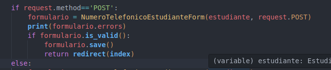

# clase03-2bim

se coloca de esa manera (e.numerotelefonico_set) en el html debido a que en la relacion del modelo entre numero telefonico y estudiante no se indica el "related_name" 

### 25 junio 2025

* Para agregar un telefono a un estudiante precargado, primero se obtiene su id en la funcion dentro de views.py con `estudiante = Estudiante.objects.get(pk=id)` se lo busca en la base de datos, para poder cargarlo en el formulario.

* Como es un metodo GET se crea un formulario con el modelo `NumeroTelefonicoForm` y se le pasa el estudiante obtenido previamente en el views.py, el campo de estudiante no se mostrara ya que se indica que ocultarlo en `self.fields["estudiante"].widget = forms.widgets.HiddenInput()`.

* Al enviar se le pasan los datos del formulario con `request.POST` a la variable formulario con el modelo `NumeroTelefonicoForm` y tambien se le pasa el estudiante que se le va a agregar el numero. 

